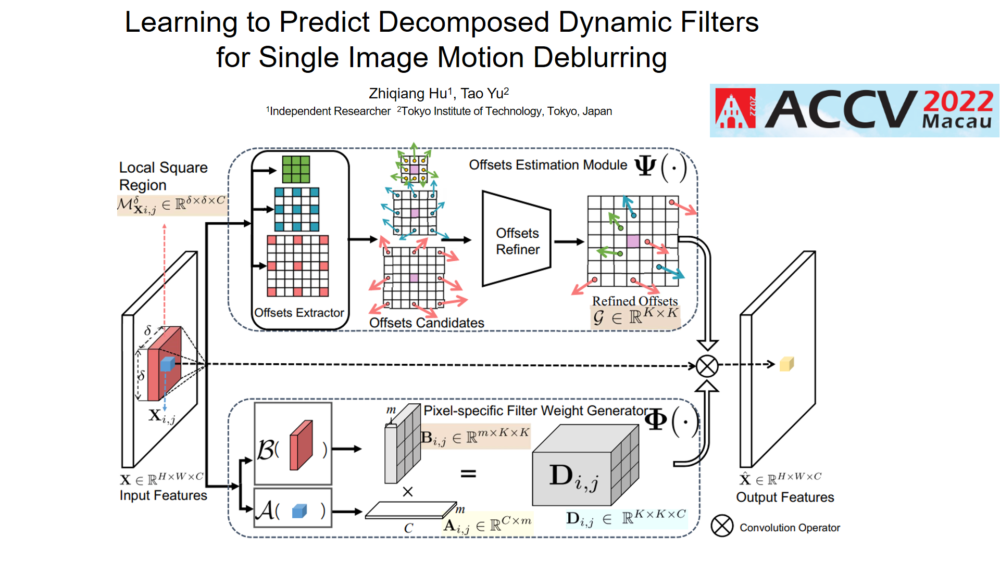

# DecomposedDynamicFilters
**Learning to Predict Decomposed Dynamic Filters for Single Image Motion Deblurring** (ACCV 2022)  
Zhiqiang HU, Tao Yu.
 [Paper](https://openaccess.thecvf.com/content/ACCV2022/papers/Hu_Learning_to_Predict_Decomposed_Dynamic_Filters_for_Single_Image_Motion_ACCV_2022_paper.pdf), [Project_page](https://github.com/ZHIQIANGHU2021/DecomposedDynamicFilters)

## Introduction
 This paper tackles the large motion variation problem in the single image dynamic scene deblurring task. Although fully convolutional multi-scale-based designs have recently advanced the state-of-the-art in single image motion deblurring. However, these approaches usually utilize vanilla convolution filters, which are not adapted to each spatial position. Consequently, it is hard to handle large motion blur variations at the pixel level. In this work, we propose Decomposed Dynamic Filters (DDF), a highly effective plug-and-play adaptive operator, to fulfill the goal of handling large motion blur variations across different spatial locations. In contrast to conventional dynamic convolution-based methods, which only predict either weight or offsets of the filter from the local feature at run time, in our work, both the offsets and weight are adaptively predicted from multi-scale local regions. The proposed operator comprises two components: 1) the offsets estimation module and 2) the pixel-specific filter weight generator. We incorporate the DDF into a lightweight encoder-decoder-based deblurring architecture to verify the performance gain. Extensive experiments conducted on the GoPro, HIDE, Real Blur, SIDD, and DND datasets demonstrate that the proposed method offers significant improvements over the state-of-the-art in accuracy as well as generalization capability. Code is available at: https://github.com/ZHIQIANGHU2021/DecomposedDynamicFilters
